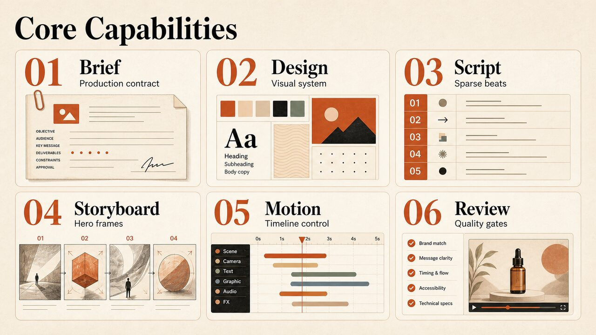

<div align="center">

# Video Ad Director

**AI production discipline for HyperFrames video ads, launch promos, and motion-led marketing films**


[](./LICENSE)
[](./SKILL.md)
[](https://nodejs.org/)

</div>

---

## What This Is

Video Ad Director is an agent skill for producing polished marketing videos with HyperFrames. It turns vague video ad requests into a reviewable production chain: creative brief, design system, script, storyboard, beat map, motion map, validation, snapshots, renders, and review reports.

```text
Input:  "Make a premium product launch ad with kinetic typography"
Output: A structured HyperFrames production workflow with artifacts, composition guidance, validation gates, and review-ready handoff
```

The skill is designed for short-form ads, product launch films, website-to-video explainers, YouTube promos, caption-led product videos, and music-synced motion graphics.

---

## Core Capabilities



It emphasizes layout before animation, sparse screen copy, deterministic GSAP timing, and strong review artifacts instead of ad hoc animation code.

---

## Production Workflow


The workflow starts from the final viewing experience and works backward through proof points, hero frames, timing, transitions, and validation.

---

## Installation

Copy this repository into your local agent skills folder, or install it through your agent runtime's skill installation workflow.

```bash
mkdir -p ~/.agents/skills
cp -R /path/to/video-ad-director ~/.agents/skills/video-ad-director
```

No package install is required to read and use the skill. The helper scripts use Node.js and are intended to run from the project root.

---

## Quick Start

Use the skill when creating a new HyperFrames ad project:

```bash
node scripts/create_project.mjs ./my-product-ad
```

Then fill the generated production artifacts in order:

```text
CREATIVE_BRIEF.md
DESIGN.md
SCRIPT.md
STORYBOARD.md
BEAT_MAP.json
MOTION_MAP.json
```

Run local structure and artifact checks when preparing a skill release:

```bash
node scripts/check-structure.mjs
node scripts/check_assets.mjs <project-dir>
node scripts/score_artifacts.mjs <project-dir>
```

For implemented HyperFrames compositions, use the strongest available HyperFrames checks:

```bash
npx hyperframes doctor
npx hyperframes lint
npx hyperframes validate
npx hyperframes inspect
npx hyperframes snapshot <composition> --at <times>
```

---

## Repository Layout

```text
SKILL.md                         Skill instructions and operating rules
templates/                       Production artifact templates
references/                      Workflow, motion, typography, review, and stability guidance
scripts/create_project.mjs       New ad project scaffold generator
scripts/check-structure.mjs      Skill release structure check
scripts/check_assets.mjs         Project asset validation helper
scripts/score_artifacts.mjs      Artifact completeness scoring
evals/                           Trigger prompts and evaluation cases
assets/                          Compressed README visual assets
```

---

## GitHub Metadata

Suggested repository description:

```text
AI agent skill for producing HyperFrames video ads from vague prompts into briefs, scripts, storyboards, GSAP motion maps, validation gates, renders, and review packs
```

Suggested topics:

```text
agent-skill video-ad-director ai-video-ads hyperframes gsap motion-design
video-production advertising kinetic-typography website-to-video youtube-promo
```

---

## License

[MIT](./LICENSE) — free to use, modify, and distribute.

---

## About The Author

| | |
|:---|:---|
| GitHub | [geekjourneyx](https://github.com/geekjourneyx) |
